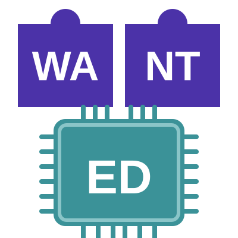

<!-- _class: lead -->
<!-- _paginate: false -->

<div style="text-align:center">

# Where the Chain of Trust Goes Dark


### Extending verified boot to signed WebAssembly workloads on microcontrollers

</div>
<br/><br/><br/><br/><br/><br/>
<div style="text-align:right">

**Kamil Wcisło** — Boot Security Mastery 2026, Gdańsk

</div>

---

## Verified boot is solved on paper

- A hardware root of trust measures and authorizes each stage: bootrom →
  bootloader → **application image**,
- then the chain **terminates at the application**,
- everything the application loads **afterward** runs unverified.

## The devices that matter, load code after boot

OTA firmware, plugins, updatable logic. For a fleet of internet-facing
microcontrollers, *that* is the attack surface — and it sits **outside** the
boot-security envelope.

_On devices that run code they download, the **chain of trust is only as long
as the runtime makes it.** How do we secure those in a portable manner?_

---

## WebAssembly 101

Not a language - a **compile target (bytecode)**: C, Go, Rust, Zig and others
**compile to** it, and a **small virtual machine (interpreter) executes it**.

Four properties do the security work and none of them depend on an OS:

1. **Memory is one flat array the module owns** - addressed to module's own
   linear memory, every access is bounds-checked. *A pointer into the host,
   the runtime's own structs, or a neighbour is not forbidden, it is **not
   expressible***.
2. **The call stack is not in that memory** - return addresses live in the VM,
   out of reach. Overflow a buffer and you corrupt only the module's own data.
3. **No ambient authority** - a module can call only the functions imported
   into it. There is no syscall table to reach for.
4. **The interpreter is to be trusted** - different modes can be used (AOT, JIT,
   fast or classic interpreter). For best security and portability
   classic-interpreter mode is good option: no codegen, no W^X window to abuse,
   but we pay with performance. Interpreter vulnerability *is* a runtime
   vulnerability.

---

## Against the thing you probably already know

|             | Container | Wasm module |
|-------------|-----------|-------------|
| Boundary    | the **kernel** | the **instruction set** |
| Shares      | kernel, environment | **nothing** |
| Host access | syscalls (minus filtered) | imported funcs |
| Memory      | MMU-controlled address space | bounds-checked array |
| To escape   | kernel bug or a loose cap | a bug in the runtime |
| Requires    | MMU and Linux | **neither** |

_The main difference is **the default**: a container starts with
**everything and you take things away**; a Wasm module starts with **nothing and
you hand things in**_.

---

## What that buys, and what it does not

Wasm itself only isolates a module **inside** a process. That is a real
boundary, and it is silent about two things.

| Wasm answers | Wasm says nothing about |
|--------------|-------------------------|
| Can this code try to reach memory it **does not own**? | Where did this code **come from**? |
| Can it call something it was **not given**?     | What is it **allowed to touch** on this device? |

Isolation is not provenance, and it is not authority - perfectly sandboxed
module of unknown origin, granted everything, is still a bad day.

---

## Let's try to answer all

<table style="border-collapse:collapse; margin:0 auto"><tr>
<td style="border:none; padding:0 1.5em 0 0">
<div style="text-align:center">

**WANTED**<br/>_**W**eb**A**ssembly **N**anocontainer **T**echnology for
**E**mbedded **D**evices_

</div>
</td>
<td style="border:none; padding:0">



</td>
</tr></table>
<style scoped>
h2 { margin-bottom: 0.15em; }
table { margin-top: 0 !important; margin-left: auto !important; margin-right: auto !important; }
table td p { margin: 0; }
p, li { font-size: 0.85em; }
ul { margin: 0.3em 0; }
li { margin: 0.15em 0; }
</style>

OSS runtime for ARM/RISC-V/Xtensa/x86 (and possibly
others) - treats the post-boot gap as a first-class boot-security problem.

- **engine** — one process; a Wasm interpreter (**WAMR**) and a VFS router
- **wapp** — an **OCI image** with Wasm module + ro filesystem with static data
- **supervisor** — system wapp that decides what engine runs
  against **signed desired state**
- **control plane** — signs that state, supervisor verifies it

**What it adds on top of Wasm:** **provenance** (signed, checked at every
load — _do we know the source_), **authority** (capabilities granted from
outside the image — _what we allow_), **identity** (desired state bound to
one device and one generation — _what we actually run and where_).

--- 

## What a wapp actually is

A **wapp** is an OCI image carrying a **Wasm module** and its read-only
filesystem — pulled like an ordinary container image. Portable - runs across
ISAs with no recompilation required.

- **One OS process, thread per workload** - an interpreter instance and a
  thread inside the engine.
- **The image cannot ask for anything** - authority arrives only through the
  signed desired state's launch config.

**What it sees through WASI (WebAssembly System Interface) — nothing but
paths:**

```sh
/            # its own OCI layers (ro)
/data        # a granted mount
/dev/gpio    # a granted driver
/net/uplink  # a granted network socket
```

---

## One continuous chain

```yaml
verified boot              # silicon: bootrom + OTP
     ▼
WANTED Engine  ◀──── hardware-rooted device identity
     ▼
signed desired state       # control plane and supervisor
     ▼
signed wapp                # checked at every load
     ▼
caps-confined execution    # Wasm linear memory + WASI
```

Each hop is a distinct trust layer with its **own key** or its **own gate**.

---

## Link 1 — Hardware root of trust

- **RP2350:** device identity sealed in on-die **OTP** behind bootrom-verified
  **signed boot** (secp256k1 + a hardware SHA-256 accelerator). **TrustZone-M**
  available to additionally isolate the control plane from workloads - not used
  for now.
- **Dual-ISA silicon:** two Arm Cortex-M33 cores or two RISC-V Hazard3 cores,
  switchable at boot. **Secure boot is Arm-only** — the bootrom enforces no
  signature check on the RISC-V path, so a secured device disables those
  cores outright.

**Two distinct, chained key layers:**

| Layer | Key | Authorizes |
|-------|-----|------------|
| Boot (silicon)         | **secp256k1** | *firmware image* |
| Control plane (WANTED) | **Ed25519**   | *runtime workloads* |

---

## How the RP2350 bootrom checks it

1. Scans flash for a signed image, copies the **whole thing into SRAM** *before*
   checking anything
   - the recommended path if enough SRAM available, since flash contents can
   change after the check (swap the chip, or emulate it with an FPGA), and
   checking-then-running in place would trust bytes that could have already moved.
2. Hashes it (**SHA-256**), decrypts the signature with the key embedded in
   the image (**secp256k1**), checks hash against signature.
3. Hashes *that key* and checks it against one of up to 4 fingerprints burned
   into **OTP** - signed by the right key, or it doesn't run.
4. **Anti-rollback** -  an optional step: version is checked against a floor
   burned into OTP that can only go up - a fuse-bit property. Booting a newer
   image raises the floor, hence older signed images are refused from then on.

---

## Link 2 — Signed control plane

The on-device supervisor — **Sheriff** — accepts only **Ed25519-signed,
CBOR-encoded, desired state**.

- Monotonic **`generation`** counter — an old or equal generation is rejected.
- **`device_id`** bound into the signed payload — a valid signature for device A
  is rejected on device B.
- The signing input is the deterministic message payload **excluding
  the signature** — spliced out before verify.

Least-trust posture: **only** Sheriff holds credentials to the control plane.

Public control plane key is provisioned to the device's side during **enrollment
process**.

---

## Link 3 — Signed images, checked at every load

Workloads ship as **content-addressed OCI layers**, SHA-256-verified in flight. 

That is the easy half. The hard half is **at rest**: the bytes sat in flash
between the download and this boot.

So the engine re-checks on every load. The signed message binds **identity to
content** — name + version, length-prefixed (without that, `foo`/`1.0` and
`foo1`/`.0` would assemble the same bytes), plus the layer digests.

- Binding name and version closes **interposition** — validly signed bytes
  installed under *another* image's reference verify against a real key, and
  would be accepted by a payload that named only the bytes.
- The verifying keyring is **compiled into the firmware** — multiple slots so
  a key can be retired without stranding old images; changing the keyring
  itself takes a firmware update.

---

## Link 4 — Capability confinement

Every workload runs in a **WASI sandbox with no ambient authority**. Hardware,
network, and filesystem exist only as **explicitly mounted, policy-authorized
capabilities** — a Plan 9-inspired VFS where *if a node isn't mounted, it's
invisible.* Example grant in desired state:

```json
{ "mounts":  [{ "name": "platform",
  "path": "/data", "options": "ro" }],   // /data (ro)
  "drivers": [{ "name": "gpio" }],       // /dev/gpio
  "sockets": [{ "name": "uplink",        // /net/uplink
    "address": "tcps://192.168.1.1:8443" }] 
} 
```

That grant **is** the capability set — no more, no less.

---

## The OTA update is where the chain often breaks

Verified boot proves the image **you already have**. The interesting question
is: *what authorizes the image you are about to become?*

On the RP2350 the bootrom answers it with **A/B slots and Try-Before-You-Buy¹**:

- The new image is staged into the slot that is **not** running.
- It is marked **provisional**. The loader boots it *on trial*.
- If nothing confirms it, the next reset **reverts to the previous slot.** A bad
  update costs a reboot.

WANTED drives that A/B slot:
- firmware is **packaged and pulled just like a wapp** — same OCI registry,
  same digest identity.
- Sheriff stages it, reboots, and **confirms or rolls back** — a bad build
  can't crash-loop.

<span style="font-size:0.6em">1. *RP2350 Datasheet, §5.1.17 "Try Before You Buy"
(p.355)*</span>

---

## The demo

**Live, on an Adafruit Feather RP2350** — no network stack on the board:

- it **enrolls** — a one-use join token redeemed for a per-device secret
- **Ed25519-verified desired state** arrives over that cable
- a **signed wapp** is published, signature-checked by the control plane,
  carried over the same cable, and run

---

## Takeaways

1. A verified boot story is **incomplete** for any device that loads post-boot
   workloads, this is **runtime trust gap**.
2. Carrying hardware-rooted trust into a content-addressed, signed software
   supply chain on constrained MCUs **is possible**.
3. **Capability-based and memory confinements** (WASI / Plan 9-like VFS) on
   bounds-checked Wasm memory are the runtime complement to verified boot — least
   privilege, and a hard memory wall.
4. **Verify at load, not at download** - an in-flight digest proves what
   arrived, only an at-rest check proves what is about to run.

---

## The chain is only as long as your runtime makes it

> *Shameless plug*

- **WANTED** — OSS, Apache-2.0 -
  [mekops.com/projects/wanted](https://mekops.com/projects/wanted/)
- slides -
  [github.com/mekops-labs/conferences-bsmconf2026](https://github.com/mekops-labs/conferences-bsmconf2026)


<br/><br/><br/><br/>
<div style="text-align:center;">


<div style="display:inline-block; background:#000; padding:0.1em 0.1em; border-radius:32px;">


</div>

<div style="font-size: 0.7em;">

© 2026 Kamil Wcisło — licensed under [CC BY-NC
4.0](https://creativecommons.org/licenses/by-nc/4.0/)

</div>

</div>
